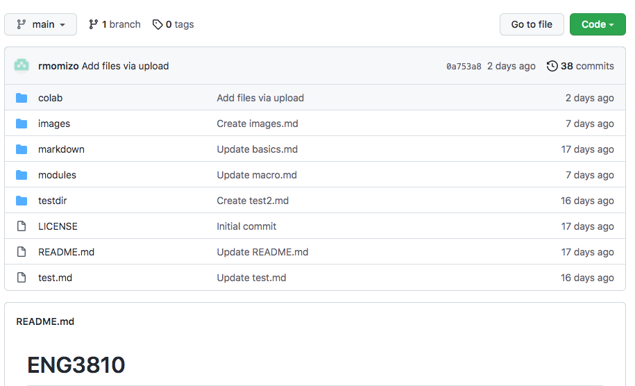

<!-- insert images from local files -->

<!-- insert images from local files with HTML -->

<!-- using HTML figure tags -->

<figure>

 
<figcaption style='font-size:.8em'>Figure 1. Screenshot of Github Repository</figcaption>

</figure>